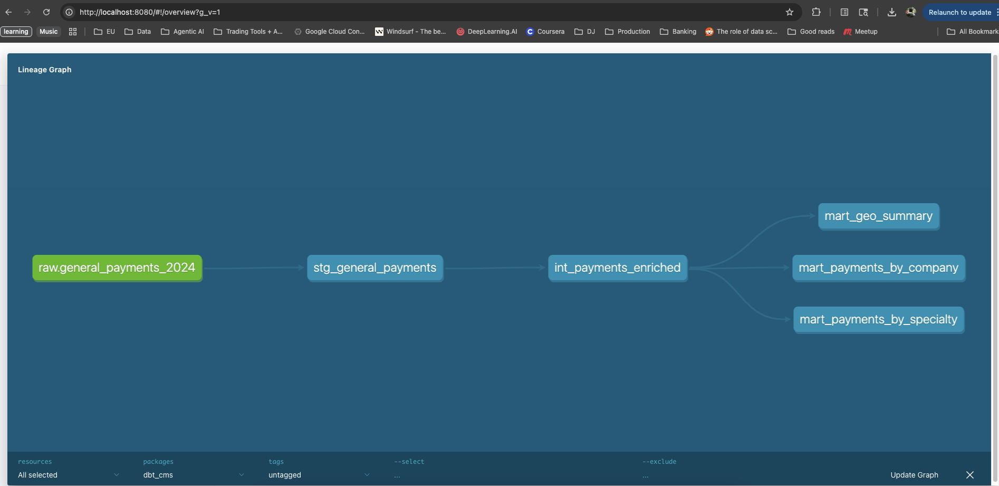

# CMS Open Payments Analytics Pipeline

End-to-end data pipeline analyzing CMS Open Payments data — pharmaceutical and medical device manufacturer payments to U.S. physicians and teaching hospitals.

## Stack

| Layer | Tool |
|---|---|
| Warehouse | Google BigQuery (free tier) |
| Transformation | dbt Core |
| Visualization | Google Data Studio (Looker Studio) |
| Ingestion | Python 3 (`google-cloud-bigquery`) |
| Version Control | Git + GitHub |

## Architecture



Raw CSV data from CMS is loaded into BigQuery using a Python ingestion script, then transformed through three dbt layers:

```
CMS CSV → BigQuery (raw) → dbt staging → dbt intermediate → dbt marts → Data Studio
```

**Raw:** CSV files loaded as-is into BigQuery. No transformations. Preserves source data for auditability.

**Staging (`stg_`):** One model per source table. Renames columns to snake_case, casts data types, trims whitespace, flags nulls.

**Intermediate (`int_`):** Light business logic. Standardizes company names, derives primary physician specialty, simplifies recipient type.

**Marts (`mart_`):** Aggregated, analysis-ready tables consumed directly by the dashboard.

| Model | Description |
|---|---|
| `mart_payments_by_company` | Top 20 companies by total payments with nature-of-payment breakdown and YoY % change |
| `mart_payments_by_specialty` | Total and average payments aggregated by physician specialty |
| `mart_geo_summary` | Total payments by state with top 5 cities per state |

## Key Findings

- **Specialty concentration:** Orthopaedic Surgery and Internal Medicine receive similar total payment volumes, but orthopaedic physicians receive far larger individual payments — reflecting a much smaller physician pool capturing a disproportionate share of industry dollars.

- **Geographic concentration:** California, Texas, and Florida account for the largest total payment volumes by a significant margin, consistent with their large physician populations.

- **Surprising #1 city:** Winter Park, FL ranks as the top city by total payments — ahead of New York and Los Angeles. The area's large concentration of older patients and specialist practices likely drives this outsized figure.

## Dashboard

Link: https://datastudio.google.com/reporting/0c567a90-0c0a-468b-91ce-617f401f789b

## How to Run

### 1. Set up GCP

- Create a GCP project and enable the BigQuery API
- Create three BigQuery datasets: `raw`, `staging`, `marts`
- Download credentials JSON and set the path in your environment

### 2. Download CMS data

Download the General Payments CSV from the [CMS Open Payments dataset page](https://www.cms.gov/OpenPayments/Data/Dataset-Downloads) and place it at:

```
~/cms-data/raw/OP_DTL_GNRL_PGYR2024_P01232026_01102026.csv
```

### 3. Run ingestion

```bash
python ingestion/load_to_bigquery.py
```

### 4. Run dbt

```bash
cd dbt_cms
dbt deps
dbt build
```

### 5. Connect Data Studio

Connect Google Data Studio to the `marts` BigQuery dataset and open the dashboard.

## Data Quality

dbt schema tests are defined in `schema.yml` and run automatically as part of `dbt build`:

- `not_null` and `unique` on all primary keys
- `not_null` on all key metrics
- `unique_combination_of_columns` (via `dbt_utils`) on composite keys in mart models

## Stretch Goals

- [ ] Add prior program years for year-over-year analysis
- [ ] Standardize city name casing in staging layer
- [ ] Add Research Payments and Ownership tables
- [ ] Airflow DAG for pipeline orchestration
- [ ] dbt docs site hosted via GitHub Pages
- [ ] Payments per capita by state (requires joining external population data)

## Dataset

**Source:** [CMS Open Payments](https://www.cms.gov/OpenPayments/Data/Dataset-Downloads)

The Open Payments program requires pharmaceutical and medical device manufacturers to report all financial transfers to U.S. physicians and teaching hospitals. Data is published annually and covers consulting fees, speaking honoraria, research grants, meals, and other transfers of value.

> Note: Open Payments data is fully public. No PHI or HIPAA concerns. Physician names and NPI numbers are public record in this context.
